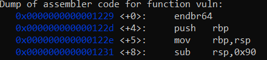
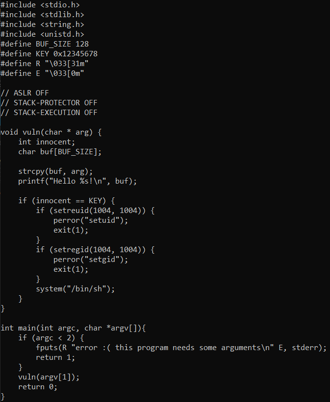
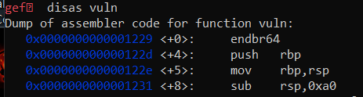
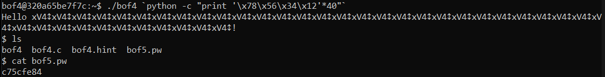
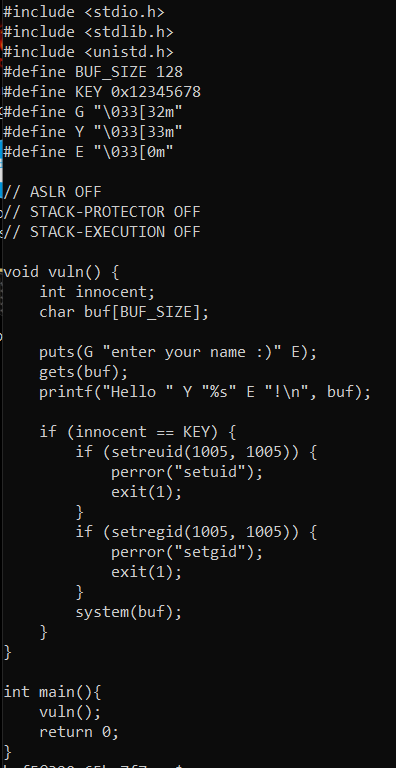
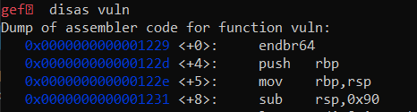
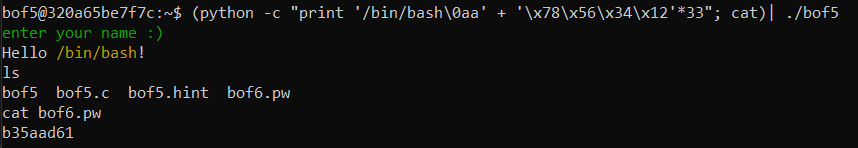

# write-up
## bof3

key가 0x61인것을 확인해서 버퍼에 의미 없는 값을 씌우고 그 위에 있는 innocent에 0x61을 씌어주면 된다. 먼저 gdb를 활용해서 통 0x90 바이트만큼의 공간 즉 144 바이트만큼의 공간이 생긴 것을 확인할 수 있고 중간에 144 - 128 - 4 = 12 바이트만큼의 더미가 생긴 것을 확인 할 수 있다. 이번에는 innocent가 제일 뒤에 있어서 141개의 a만 출력한다면 됐지만 이가 안통할 수 있으니 4바이트씩 줄이면서 innocent에 맞춰야할 수도 있다. 

## bof4

이번에는 key가 0x12345678이다 이 또한 위에서 했던 접근 방식으로 점근이 가능하다 다만 int인 innocent는 little endian방식으로 되어있어서 \x78\x56\x34\x12의 방식으로 들어가야 이를 0x12345678로 읽는다. 이것만 주의하면 bof3과 똑같은 문제이다. 총 0xa0 즉 160 바이트가 생긴것을 확인할 수 있었고 계한하기 귀찮으니 4바이트인 \x78\x56\x34\x12를 40번 반복해 160바이트를 다 채워 innocent를 덮어주는 방식으로 했다. 

## bof5

이 문제같은 경우에는 buf에 들어간 스트링으로 system call을 진행하기 떄문에 입력할 때 "/bin/bash"를 넣어주고 innocent를 key값으로 맞춰주면 된다. 위에서 했던 방식과 같지만 앞에 /bin/bash를 넣고 그만큼의 바이트를 뺀 뒤 \x78\x56\x34\x12를 넣어줘서 key에 맞추는 방식으로 문제를 해결했다. 
