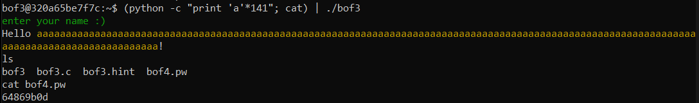
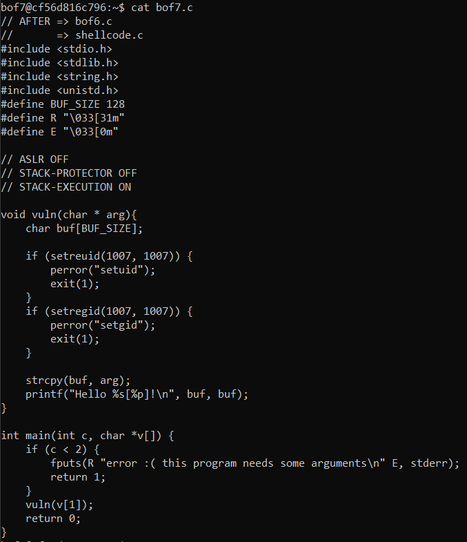

# write-up
## bof3

key가 0x61인것을 확인해서 버퍼에 의미 없는 값을 씌우고 그 위에 있는 innocent에 0x61을 씌어주면 된다. 먼저 gdb를 활용해서 통 0x90 바이트만큼의 공간 즉 144 바이트만큼의 공간이 생긴 것을 확인할 수 있고 중간에 144 - 128 - 4 = 12 바이트만큼의 더미가 생긴 것을 확인 할 수 있다. 이번에는 innocent가 제일 뒤에 있어서 141개의 a만 출력한다면 됐지만 이가 안통할 수 있으니 4바이트씩 줄이면서 innocent에 맞춰야할 수도 있다. 

## bof4

이번에는 key가 0x12345678이다 이 또한 위에서 했던 접근 방식으로 점근이 가능하다 다만 int인 innocent는 little endian방식으로 되어있어서 \x78\x56\x34\x12의 방식으로 들어가야 이를 0x12345678로 읽는다. 이것만 주의하면 bof3과 똑같은 문제이다. 총 0xa0 즉 160 바이트가 생긴것을 확인할 수 있었고 계한하기 귀찮으니 4바이트인 \x78\x56\x34\x12를 40번 반복해 160바이트를 다 채워 innocent를 덮어주는 방식으로 했다. 

## bof5

이 문제같은 경우에는 buf에 들어간 스트링으로 system call을 진행하기 떄문에 입력할 때 "/bin/bash"를 넣어주고 innocent를 key값으로 맞춰주면 된다. 위에서 했던 방식과 같지만 앞에 /bin/bash를 넣고 그만큼의 바이트를 뺀 뒤 \x78\x56\x34\x12를 넣어줘서 key에 맞추는 방식으로 문제를 해결했다. 

## bof6

이 문제는 이미 셸 코드가 입력되어있기 때문에 ret를 셸 코드가 입력되어 있는 주소로만 써주면 된다. 이를 위해선 먼저 shellcode[]가 얼마나 차지하고 있는지 알아야 buf와 sfp를 합쳐서 얼마나 덮어야 되는지 알 수 있다. 두번째 사진에 보면 lea [rbp - 0xa0]와 lea [rbp - 0x80]를 확인할 수 있다. 0xa0 와 0x80은 각각 160과 128이다. 즉 shellcode[]가 32바이트를 차지하고 우리는 128 + 8(sfp)를 덮은 뒤 주소를 써주면 되는 것을 알 수 있다. 이렇게 작성한 payload를 통해서 셸을 딴 모습을 확인할 수 있다. (지금은 shellcode의 주소가 고정되어서 이를 한번 확인한 뒤 작업을 진행하면 됐지만 원래부터 고정이 되어있지는 않았다. docker를 실행할 때 `docker run -it -—privileged ccss17/bof` 를 통해서 privilege 모드로 들어와야 주소가 고정되어서 문제를 풀 수 있다.)

## bof7

이 문제는 bof6과 비슷하지만 직접 쉘코드를 넣어줘야 한다는 차이점이 있다. buf에 bof6에서 등장한 쉘 코드를 넣어주고 sfp까지 아무 값이나 채워준 뒤 ret를 buf의 주소로 써서 쉘 코드를 작동하게 하는 방식이다. 이번에 애를 먹었던 부분이 있다면 처음에 rsp를 sub 0x90, 즉 144바이트를 할당해서 당연히 144 - 27 (쉘코드 바이트) + 8 (sfp) = 125를 임의의 값으로 덮은 뒤 ret주소를 썼지만 144바이트가 아닌 128바이트에 buf가 위치해있었다. 즉 sfp와 buf 사이에 더미가 없었다. 이는 strcpy에서 0x80, 128 바이트를 띄운 것을 확인해서 알 수 있었다. 그래서 128 - 27 + 8 = 109 바이트의 임의의 값과 ret주소로 buf의 주소를 써주었다. 또한 privilege 모드로 들어왔지만 주소가 조금씩 바껴서 안 될 때마다 확인을 해줘야했다. 

## bof8

이 문제는 환경변수를 사용해서 해킹을 하는 방법을 사용한다. 먼저 환경변수를 설정해줘야 한다. `export [varname]="value"` 로 생성을 해준다. 이 때 `=` 앞뒤로 띄어쓰기 없이 붙여주는 게 관건이다. 이후 주소를 알아내고 ret를 환경변수 주소로 써주면 된다. 이번에도 역시 bof7처럼 총 16바이트를 뛰지만 실제로 buf는 8바이트 떨어진 곳에 위치한 것을 strcpy를 호출할 때 확인할 수 있다. 고로 16바이트의 임의의 값과 8바이트의 환경변수의 주소를 써주면 된다. 

## bof10
bof10의 패스워드는 d475db45 입니다.

## GOT overwrite

먼저 got overwrite란 dynamic linking으로 컴파일 된 프로그렘의 허점을 비집고 해킹을 하는 방식이다. dynamic linking이란 코드를 컴파일 하면 오브젝트 파일이 생기는데 여기서 우리가 일반적으로 사용하는 printf같은 함수들은 라이브러리에서 가져와서 쓰는거기 때문에 무슨 기능을 하는지 어떻게 작동하는지 오브젝트 파일은 모른다. 따라서 이 함수가 어디에서 왔으며 어떻게 작동하는지 알려주는 linking이라는 단계를 거쳐서 오브젝트 파일에게 "봐봐 얘는 이런 일을 하는 함수야"라고 알려준다. 

이런 linking과정은 크게 두 가지로 나눠는데 static과 dynamic이다. static이란 #include로 가져온 모든 라이브러리들을 실제로 다 가져온다, 사용하지 않는 함수들에 대한 정보도 있고 양도 실로 어마어마하기 때문에 static linking의 방식으로 만들어진 실행파일의 사이즈는 어마어마하다. 또한 라이브러리들이 업데이트 됐을 때 이를 바로바로 적용 받지 못하고 다시 한 번 더 컴파일을 하는 등 번거로움이 많아서 많이 안쓰이는 추세이다. 나머지 하나인 dynamic linking은 이런 라이브러리들을 실행파일에 포함시키지 않고 plt(procedure linkage table)와 got(global offsets table) 테이블들을 통해서 (plt에서 got를 호출하고 got에서 실제 주소를 받는다.) 실제로 함수들이 호출될 때 함수들의 구현된 코드의 주소를 알려주는 방식으로 진행이 된다. 실제로 라이브러리를 가져오지 않으니 사이즈는 당연히 비교가 안될 정도로 작고, 라이브러리 업데이트등 변화에도 잘 적응하는 장점이 있다. 
> static linking으로 컴파일된 실행파일은 GOT overwrite 방식으로 해킹할 수 없다. 

> TODO: 왜 plt를 거쳐서 got 테이블로 가는가?

해킹의 원리는 이렇다. 원하는 함수를 plt에서 상응하는 got 주소를 찾는다. got에서는 함수의 주소가 담겨저 있다. 그 함수의 실제 주소를 다른 함수로 대체하는 것이다. 예를 들어 puts를 system으로 대체한뒤 puts에게 "/bin/bash"라는 스트링을 넘겨주면 system("/bin/bash")가 되는 격이다. 한가지 주의할 점은 got의 주소는 실제로 돌아갈 때만 알 수 있으므로 gdb에서 브레이크를 걸어둔 뒤 got에서 가르키고 있는 주소와 system의 주소를 알아낸 뒤 작업을 해야한다. 

문제는 간단히 main함수에 브레이크를 걸고 gets로 받는 문자열을 '/bin/bash'로 입력해준 뒤 
puts@plt가 가는 주소 0x80490a0을 disasamble한 뒤 점프하는 주소 *0x804c014를 p system으로 알아낸 system의 주소로 대체 해주면 끝이다. gdb안에서 쉘을 딴 모습을 확인할 수 있다. 

## SFP(stack frame pointer) overflow
sfp overflow 공격은 먼저 함수의 프롤로그와 에필로그를 살펴볼 필요가 있다. 함수가 처음 호출됐을 때에 스택에 이전 함수의 stack base pointer를 저장하고 이전 함수의 stack pointer가 새롭게 호출된 함수의 base pointer가 된다. 그리고 함수를 다 실행했으면 이 함수를 호출한 함수로 돌아가야하는데 이때를 함수의 에필로그라고 부른다. 이 에필로그에서 하는 일은 크게 2개인데, 이는 leave와 ret이다. leave에서는 프롤로그에서 저장한 stack pointer를 다시 가지고 온다. ret는 다시 돌아가야하는 함수의 명령어의 주소를 가지고와서 이 주소가 가르키고 있는 곳으로 가서 이전 함수의 명령들을 실행한다.
||
|:---:|
|func2 buf|
|func2 sfp|
|to func1 ret|
|func1 buf|
|func1 sfp|
|to func1's caller ret|

 이 ret와 스택의 구조를 이용해서 해킹을 하는 것이다. 위에 테이블을 보면 sfp아래는 항상 ret가 있다. 즉 주소가 있는 것이다. 만약 우리가 정상적으로 저장된 sfp를 조작해서 다른 곳으로 보낼 수 있다면 프로그램은 당연히 조작된 sfp 아래에서 ret 주소를 찾는다는 것이고 이는 해킹의 여지를 주는 것이다. 
 > 이 해킹이 가능할려면 먼저 main함수가 다른 함수를 불러야하고, 그 다른함수에서sfp를 건드릴 수 있어야 한다. 그리고 단 1바이트라도 조작이 가능하면 이 해킹을 얼마든지 할 수 있다. 

해킹의 진행방식은 이렇다. 먼저 main이 다른 함수 func()를 호출한다. 그리고 공교롭게도 이 func()에서는 buf보다 1바이트를 더 받아서 해킹의 여지를 남겨주었다. littel endian 방식으로 되어있다는 가정하에 그 한 바이트는 sfp의 가장 작은 자릿수이고 이를 다른 위치 (조작을 할 수 있는 buf)로 바꿔버린다. 그리고 func()를 종료한다. 그렇다면 main의 base pointer는 우리가 정한 위치로 가 있을 것이다. 그리고 여기서 main이 종료한다면? 우리가 조작한 base pointer 아래에 있는 ret주소에 있는 함수를 호출할려고 할 거다. 따라서 우리는 buf의 주소로 sfp를 조작하고 buf의 첫 4바이트 (64bit 기기에서는 8바이트)를 임의의 값으로 채워준 뒤 그 뒤에 우리가 심어둔 코드의 주소를 써주면 되는 것이다. buf는 이렇게 될 것이다. 32bit machine에서 "aaaa"+"bbbb"+"shellcode"; "aaaa"는 4바이트의 진짜 아무 값, "bbbb"는 "shellcode"의 주소, "shellcode"는 쉘을 실행하는 코드 `\x31\xc0\x50\x68\x2f\x2f\x73\x68\x68\x2f\x62\x69\x6e\x89\xe3\x50\x53\x89\xe1\x89\xc2\xb0\x0b\xcd\x80` 이런 것이 될 것이다. 그렇다면 main 함수가 끝이 난 뒤 aaaa를 stack pointer로 bbbb를 instruction의 위치로 착각하고 bbbb의 위치로 뛰어서 거기에 있는 코드를 실행할 것이고, 거기에는 우리가 심어놓은 쉘을 따는 코드가 입을 벌리고 기다리고 있을 것이다. 주의할 점은 쉘 코드 이후 nop를 심어줘야 어디까지가 instruction인지 알 수 있다. 

문제를 보면 총 40바이트를 받지만 41까지 cpy를 해줘서 sfp를 조작할 수 있다. 따라서 buf가 위치한 곳으로 우회시켜준다. payload에서 '\x30'이 조작하는 부분이다. 스택을 보면 0xffffd734에 입력값 0xffffd738이 들어가 있는 것을 볼 수 있다. (사실 buf는 34에서 시작하지만 임의의 4바이트를 넣기 귀찮아서 30으로 뛴 것이다.) 그렇다면 0xffffd738는 당연히 쉘코드가 존재하는 바로 옆에있는 놈의 주소이다. 두번째 사진은 main이 모든 일을 다 끝내고 ret 호출만 남긴 상태의 스택이다. 여기서 보면 함수는 0xffffd738로 갈 준비를 하고 있다. (주소를 써야 되는 것을 쉘코드를 직접 넣은 뒤 2시간 헤맸으니.. ret는 주소라는 것을 명심하자) 그리고 스택의 위치는 gdb로 파악을 해야된다. 이렇게 gdb에서 쉘을 딴 모습이다. 
